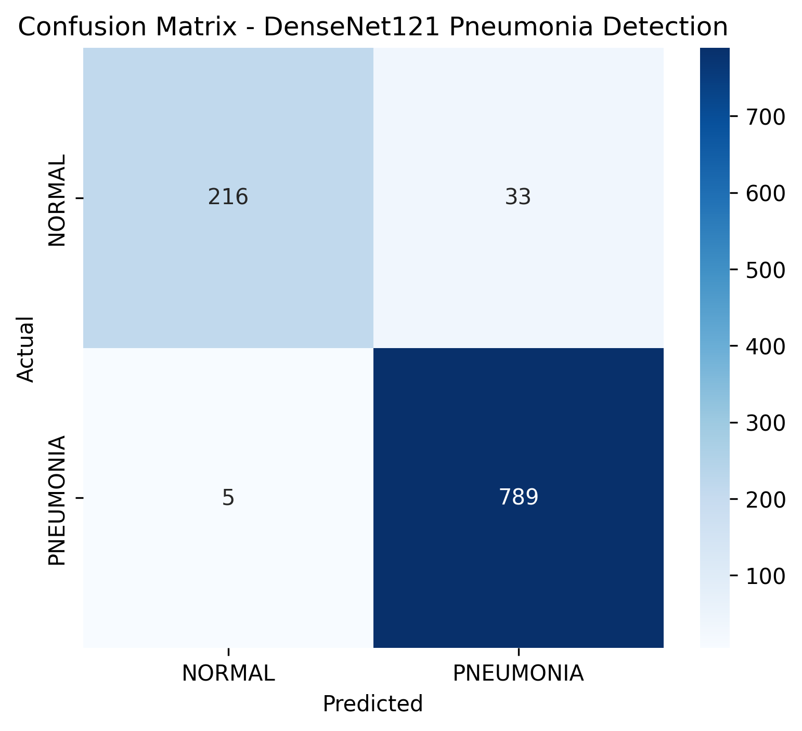

## Chest X-Ray Pneumonia Detection using DenseNet121

- Author: Karan Singh
- Program: B.Tech Computer Science & Engineering (AI & ML)
- University: Graphic Era Hill University


## 📌 Project Overview

This project leverages Deep Learning and Transfer Learning techniques to detect Pneumonia from Chest X-Ray images.

Initially, the dataset contained three classes:

* Bacterial Pneumonia
* Viral Pneumonia
* Normal

During experimentation, it was observed that the model struggled to effectively distinguish between Viral and Bacterial Pneumonia. To improve performance and focus on a clinically relevant screening task, both pneumonia classes were merged into a single Pneumonia category, resulting in a binary classification problem.

Final Classes

* Normal
* Pneumonia


## 📂 Dataset

The dataset consists of Chest X-Ray images categorized into Normal and Pneumonia classes.

Original Dataset Classes

* Bacterial Pneumonia
* Viral Pneumonia
* Normal

Final Dataset Classes

* Normal
* Pneumonia

All images were resized to 224 × 224 pixels before training.


## 🔄 Data Preprocessing

The following preprocessing techniques were applied:

* Image Resizing (224 × 224)
* Random Horizontal Flip
* Random Rotation
* Random Zoom
* Batch Size: 32

These techniques help improve model generalization and reduce overfitting.


## 🧠 Model Architecture

Transfer Learning was implemented using DenseNet121 pretrained on ImageNet.

Architecture

DenseNet121 (Pretrained on ImageNet)
            ↓
GlobalAveragePooling2D
            ↓
        Dense Layers
            ↓
          Dropout
            ↓
    Sigmoid Output Layer

The final layers of DenseNet121 were fine-tuned to adapt the model for medical image classification.

⸻

## 🛠 Technologies Used

* Python
* TensorFlow
* Keras
* DenseNet121
* NumPy
* Matplotlib
* Seaborn
* Scikit-Learn
* Keras Tuner


## 🚀 Training Strategy

* Transfer Learning
* Fine-Tuning of DenseNet121
* Hyperparameter Tuning using Keras Tuner
* Early Stopping
* Data Augmentation


## 📊 Evaluation Metrics

The model was evaluated using:

* Accuracy
* Precision
* Recall
* F1 Score
* Classification Report
* Confusion Matrix


## 📈 Results

| Metric | Score |
|---------|---------|
| Accuracy | 96% |
| Precision | 96% |
| Recall | 99% |
| F1 Score | 98% |

The model demonstrates strong performance in detecting Pneumonia while maintaining a very low false-negative rate.


## 📋 Classification Report

| Class | Precision | Recall | F1-Score |
|---------|---------|---------|---------|
| Normal | 0.98 | 0.87 | 0.92 |
| Pneumonia | 0.96 | 0.99 | 0.98 |


## 🔍 Confusion Matrix

The confusion matrix summarizes the classification performance of the model on the test dataset.



## 💡 Key Insight

The initial three-class classification model achieved approximately 76% accuracy and showed significant confusion between Viral and Bacterial Pneumonia.

After converting the task into a binary classification problem:

* Normal
* Pneumonia

the model achieved:

* 96% Accuracy
* 99% Recall for Pneumonia
* 98% F1 Score for Pneumonia

The final model misclassified only 5 Pneumonia cases as Normal, resulting in a very low false-negative rate, which is critical for medical screening applications.


## 🔮 Future Improvements

* Grad-CAM Explainability
* Web Application Deployment using Flask/FastAPI
* Multi-Class Pneumonia Classification
* Real-Time Medical Image Analysis


## 📁 Repository Structure

```text
Chest-XRay-Pneumonia-Detection/
│
├── x-ray-cnn-model.ipynb
├── README.md
├── requirements.txt
├── images/
│   └── confusion_matrix.png
└── model/
    └── pneumonia_detector.keras
```


## 🤝 Connect With Me

* GitHub: https://github.com/Karan56-cyber
* LinkedIn: https://www.linkedin.com/in/karan-singh-6a63aa325/
